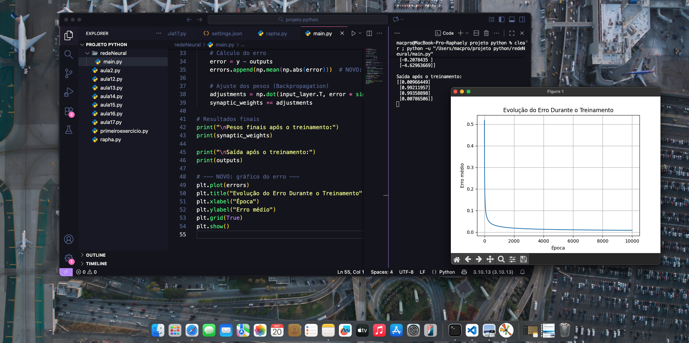

# Projeto: Implementação de Rede Neural Artificial (RNA) para Classificação Binária

## 📝 Descrição
Este projeto é uma implementação fundamental de uma Rede Neural Artificial (RNA), desenvolvida do zero em Python como parte dos estudos em Fundamentos de Inteligência Artificial. O objetivo foi simular o aprendizado e demonstrar a compreensão prática do mecanismo de ajuste de pesos (sinapses) por meio da retropropagação. A rede foi configurada para resolver um problema básico de classificação binária.

## 💻 Stack Tecnológico
* **Linguagem:** Python
* **Biblioteca NumPy:** Essencial para lidar com todas as operações matriciais necessárias, como o produto interno no *feedforward* e o cálculo do gradiente no *backpropagation*.
* **Biblioteca Matplotlib:** Utilizada para visualização e registro da convergência do erro durante o treinamento.
* **Ambiente:** Desenvolvido no Visual Studio Code (VS Code).

## ⚙️ Arquitetura e Metodologia
A arquitetura consiste em uma rede simples de uma única camada:

* **Função de Ativação:** Utilização da **Função Sigmoide** e sua derivada. A Sigmoide comprime a saída entre 0 e 1, ideal para classificação de probabilidade.
* **Treinamento (Backpropagation):** O loop de treinamento foi executado por **10.000 épocas**. Em cada iteração, a rede realizou a propagação para frente (*feedforward*) e utilizou o erro para retropropagar e calcular o ajuste necessário nos pesos (*backpropagation*).

## 📊 Resultados e Análise

### 1. Convergência do Erro
A convergência do erro é a evidência mais forte do aprendizado. O erro médio, que se inicia alto, caiu drasticamente nas primeiras épocas, estabilizando-se em um valor muito próximo de zero. Isso demonstra que a rede convergiu de forma rápida e estável.
## 📉 Resultado da Convergência (Gráfico de Erro)
O gráfico abaixo demonstra a evolução do erro médio da rede neural ao longo das épocas de treinamento, mostrando a convergência do modelo.

### 2. Saída Final e Precisão
A saída final confirma a precisão da classificação. Para as entradas onde a resposta esperada era 0, a rede produziu valores como **0.01**, e para as entradas esperadas como 1, produziu valores de alta confiança (**0.98** e **0.89**).

## 🔑 Conclusão do Estudo
O exercício prático atingiu seu objetivo, fornecendo uma base sólida sobre o mecanismo de aprendizado. Observar o erro caindo e os pesos se ajustando reforça a compreensão de que o aprendizado de máquina é, essencialmente, um processo de otimização matemática. Este projeto serve como uma base sólida para o desenvolvimento de redes neurais mais complexas no futuro.
